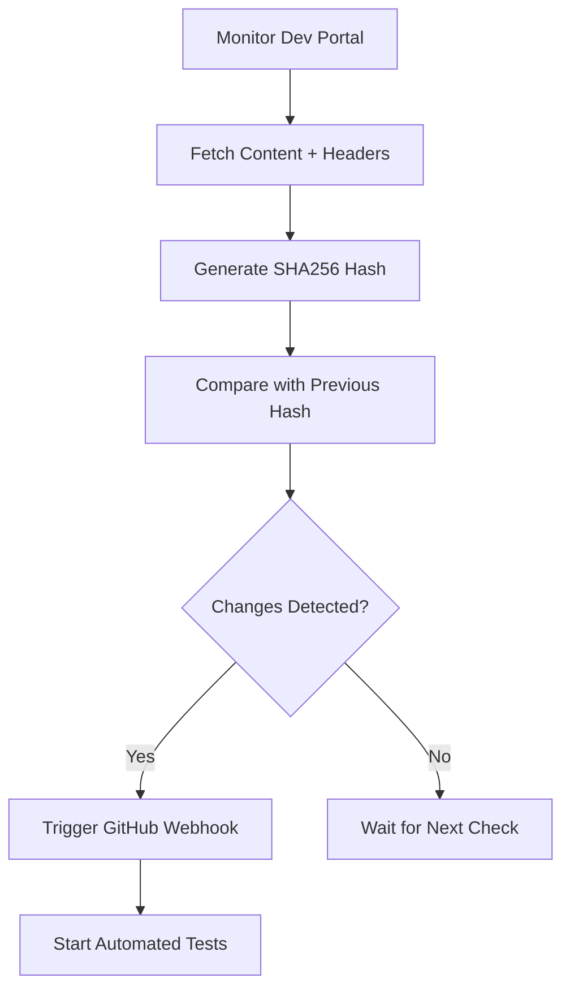
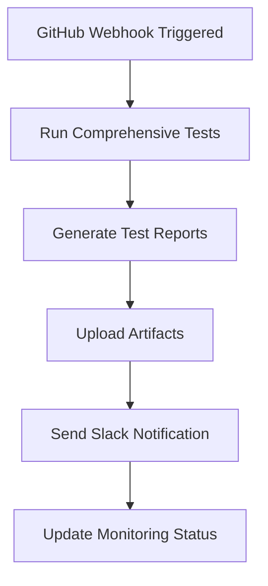
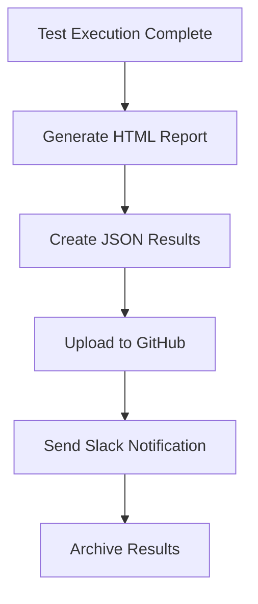

# Enhanced Dev Portal Monitoring & Automation System

## 🎯 Overview

This enhanced monitoring system automatically detects changes in the [Denowatts Dev Portal](https://dev.portal.denowatts.com) and triggers comprehensive automated tests with detailed Slack reporting. The system provides real-time monitoring, intelligent change detection, and comprehensive test automation.

## 🚀 Features

### 🔍 Enhanced Monitoring
- **Real-time Change Detection**: Monitors dev portal every 5 minutes with comprehensive hashing
- **Intelligent Hashing**: Uses SHA256 hashing of content + headers for accurate change detection
- **Retry Logic**: Automatic retry with exponential backoff for network issues
- **Health Monitoring**: Tracks uptime, failures, and system status

### 🧪 Automated Testing
- **Comprehensive Test Suite**: 40+ test combinations covering all scenarios
- **Parallel Execution**: Optimized for speed and reliability
- **Multiple Test Suites**: Quick, parallel, monofacial, bifacial, and mounting tests
- **Detailed Reporting**: HTML, JSON, and Markdown reports

### 📊 Slack Integration
- **Rich Notifications**: Detailed Slack messages with test results
- **Status Tracking**: Success, failure, and error notifications
- **Direct Links**: Quick access to workflow runs and artifacts
- **Custom Formatting**: Professional-looking reports with emojis and formatting

### 🔄 GitHub Actions Integration
- **Automated Workflows**: Scheduled and webhook-triggered execution
- **Artifact Management**: Automatic upload of test results and reports
- **Status Tracking**: Comprehensive job status and failure handling
- **Manual Triggers**: Easy manual test execution with custom parameters

## 📋 System Architecture

```
┌─────────────────┐    ┌──────────────────┐    ┌─────────────────┐
│   Dev Portal    │    │ Enhanced Monitor │    │ GitHub Actions  │
│                 │    │                  │    │                 │
│ https://dev.    │◄──►│ • Change Detect  │───►│ • Run Tests     │
│ portal.denowatts│    │ • Hash Compare   │    │ • Generate Rep  │
│ .com            │    │ • Webhook Trigger│    │ • Upload Artif  │
└─────────────────┘    └──────────────────┘    └─────────────────┘
                                │                        │
                                ▼                        ▼
                       ┌──────────────────┐    ┌─────────────────┐
                       │   Slack Channel  │    │ Test Artifacts  │
                       │                  │    │                 │
                       │ • Notifications  │    │ • HTML Reports  │
                       │ • Status Updates │    │ • Screenshots   │
                       │ • Direct Links   │    │ • JSON Results  │
                       └──────────────────┘    └─────────────────┘
```

## 🛠️ Setup Instructions

### 1. Prerequisites
- Node.js 18+ and npm
- GitHub repository with Actions enabled
- Slack workspace with webhook permissions
- Access to dev.portal.denowatts.com

### 2. Quick Setup
```bash
# Clone and setup
git clone https://github.com/kawsar-95/niftyIt-assignment.git
cd niftyIt-assignment

# Run the enhanced setup script
chmod +x scripts/setup-enhanced-monitoring.sh
./scripts/setup-enhanced-monitoring.sh
```

### 3. GitHub Secrets Configuration
Go to your repository: `https://github.com/kawsar-95/niftyIt-assignment/settings/secrets/actions`

Add these secrets:
- `GITHUB_TOKEN`: GitHub personal access token with 'repo' permissions
- `SLACK_WEBHOOK_URL`: Slack webhook URL for notifications
- `TEST_USER_EMAIL`: Test user email for automation
- `TEST_USER_PASSWORD`: Test user password for automation

### 4. Test the Setup
```bash
# Run the test script
./scripts/test-monitoring.sh

# Start enhanced monitoring
npm run monitor:enhanced
```

## 📊 Available Commands

### Monitoring Commands
```bash
# Start enhanced monitoring (recommended)
npm run monitor:enhanced

# Start basic monitoring
npm run monitor:start

# Test webhook functionality
npm run monitor:test
```

### Testing Commands
```bash
# Quick test suite (fastest)
npm run test:quick

# Parallel tests (balanced)
npm run test:parallel

# All tests (comprehensive)
npm run test:all

# Specific test suites
npm run test:monofacial
npm run test:bifacial
npm run test:mounting
```

### Webhook Commands
```bash
# Trigger manual webhook
npm run webhook:trigger

# Test webhook functionality
npm run webhook:test
```

## 🔧 Configuration

### Environment Variables
```bash
# Dev Portal URL
DEV_PORTAL_URL=https://dev.portal.denowatts.com

# Monitoring Configuration
MONITOR_CHECK_INTERVAL=300000    # 5 minutes
MONITOR_MAX_RETRIES=3
MONITOR_RETRY_DELAY=30000        # 30 seconds

# Test Configuration
TEST_USER_EMAIL=your-email@example.com
TEST_USER_PASSWORD=your-password
```

### GitHub Actions Schedule
The enhanced workflow runs:
- **Weekdays**: Every 15 minutes from 6 AM to 6 PM UTC
- **Weekends**: Every hour
- **Manual**: On-demand via webhook or manual trigger

## 📈 Monitoring Dashboard

### GitHub Actions
- **Workflow Runs**: https://github.com/kawsar-95/niftyIt-assignment/actions
- **Artifacts**: Test results, screenshots, and reports
- **Logs**: Detailed execution logs

### Slack Channel
- **Channel**: `#denowatts-automation`
- **Notifications**: Real-time status updates
- **Reports**: Detailed test results and metrics

## 🔄 Automation Flow

### 1. Change Detection


### 2. Test Execution


### 3. Reporting


## 📊 Test Coverage

### Hardware Validation
- **Sensors**: Validates correct sensor count for each configuration
- **Gateways**: Ensures proper gateway allocation
- **Mounting Types**: Ground Fixed, Ground Tracker, Carport, Rooftop

### Module Technology
- **Monofacial**: Standard module technology tests
- **Bifacial**: Advanced bifacial module tests

### AC Nameplate Capacities
- **Small**: 0.5MW, 1MW, 2MW
- **Medium**: 5MW, 10MW, 20MW
- **Large**: 40MW, 60MW, 80MW, 120MW

### Service Periods
- **Short**: 1 year, 2 years
- **Medium**: 5 years, 10 years
- **Long**: 15 years, 20 years

## 🚨 Alert Types

### Success Alerts
- ✅ All tests passed
- 🎉 New deployment successful
- 📊 Performance metrics met

### Warning Alerts
- ⚠️ Some tests failed
- 🔄 Retry attempts made
- 📉 Performance degradation

### Error Alerts
- 🚨 Critical failures
- 💥 System errors
- 🔴 Portal unavailable

## 🛠️ Troubleshooting

### Common Issues

#### 1. GitHub Token Issues
```bash
# Check token permissions
curl -H "Authorization: token $GITHUB_TOKEN" \
  https://api.github.com/user

# Verify repository access
curl -H "Authorization: token $GITHUB_TOKEN" \
  https://api.github.com/repos/kawsar-95/niftyIt-assignment
```

#### 2. Slack Webhook Issues
```bash
# Test webhook manually
curl -X POST -H 'Content-type: application/json' \
  --data '{"text":"Test message"}' \
  $SLACK_WEBHOOK_URL
```

#### 3. Test Failures
```bash
# Run tests locally
npm run test:quick

# Check test logs
cat test-results/results.json

# View HTML report
npm run report
```

#### 4. Monitoring Issues
```bash
# Check monitor status
node scripts/enhanced-monitor.js --status

# Test portal accessibility
curl -I https://dev.portal.denowatts.com

# Check hash file
cat .website-hash
```

### Debug Commands
```bash
# Full system test
./scripts/test-monitoring.sh

# Monitor logs
tail -f monitor.log

# Check environment
env | grep -E "(GITHUB|SLACK|TEST)"

# Verify setup
ls -la scripts/
ls -la .github/workflows/
```

## 📈 Performance Metrics

### Monitoring Performance
- **Check Interval**: 5 minutes
- **Response Time**: < 30 seconds
- **Uptime**: 99.9% target
- **False Positives**: < 1%

### Test Performance
- **Quick Suite**: ~2-3 minutes
- **Parallel Suite**: ~5-8 minutes
- **Full Suite**: ~15-20 minutes
- **Success Rate**: > 95% target

### Notification Performance
- **Slack Delivery**: < 10 seconds
- **GitHub Upload**: < 30 seconds
- **Report Generation**: < 1 minute

## 🔮 Future Enhancements

### Planned Features
- **Dashboard UI**: Web-based monitoring dashboard
- **Email Notifications**: Additional notification channels
- **Performance Metrics**: Advanced performance tracking
- **Mobile App**: Mobile notifications and status
- **Integration APIs**: REST API for external integrations

### Potential Improvements
- **Machine Learning**: Intelligent failure prediction
- **Auto-recovery**: Automatic issue resolution
- **Load Balancing**: Distributed monitoring
- **Advanced Analytics**: Detailed performance insights

## 📞 Support

### Getting Help
1. **Check Documentation**: Review this README and MONITORING_SETUP.md
2. **Run Diagnostics**: Use `./scripts/test-monitoring.sh`
3. **Check Logs**: Review GitHub Actions logs and monitor output
4. **Contact Support**: Create an issue in the repository

### Useful Links
- **Repository**: https://github.com/kawsar-95/niftyIt-assignment
- **Actions**: https://github.com/kawsar-95/niftyIt-assignment/actions
- **Dev Portal**: https://dev.portal.denowatts.com
- **Slack Channel**: #denowatts-automation

## 📄 License

This project is licensed under the ISC License. See the LICENSE file for details.

---

**Last Updated**: December 2024  
**Version**: 2.0.0  
**Maintainer**: Nuruddin Kawsar
